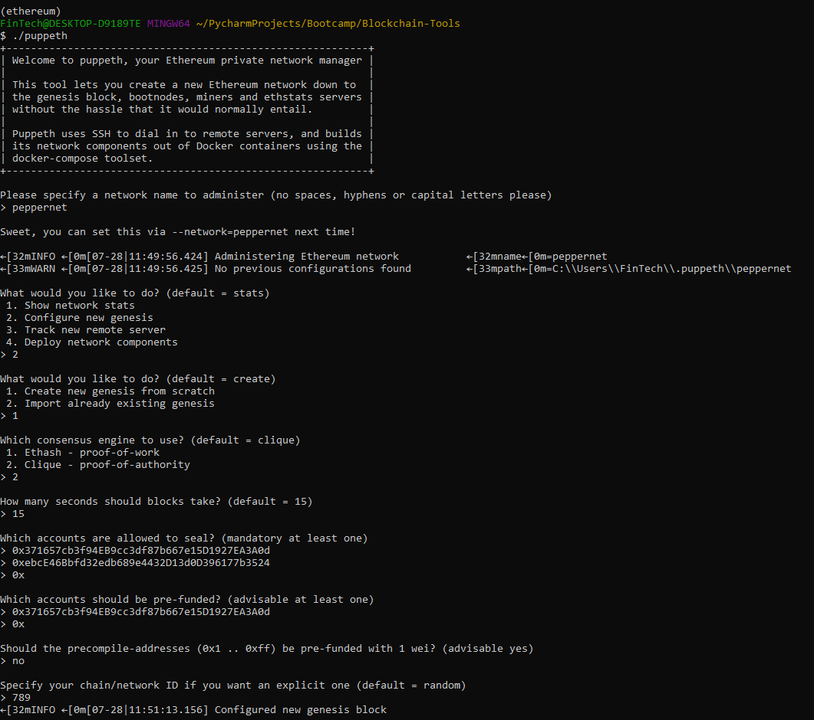
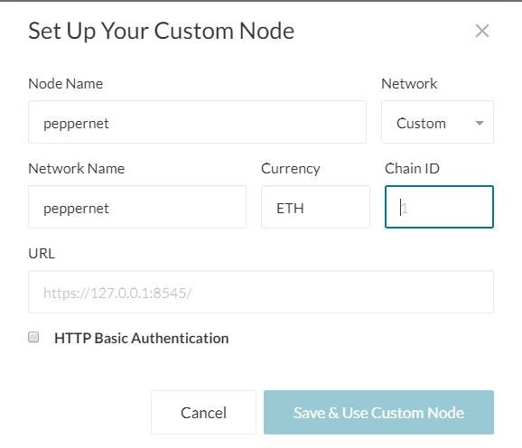

# 18-Blockchain
## Step 1 - Sett up environment and depedencies
- MyCrypto is a free, open-source, client-side interface tat allows you to interact directly with the blockchain. Download can be found in https://download.mycrypto.com/.
- Go Ethereum is one of the three original implementations of the Ethereum protocl. We can create our own blockchain, from the genesis block to mining tokens and making transactions. Go Ethereum Tolls can be found in https://geth.ethereum.org/downloads/. "Geth & Tools 1.9.7" is the version you should use.

## Step 2 - Create nodes
- In git bash, create two new nodes with new account addresses that will serve as pre-approved sealer addresses.

    `./geth --datadir node1 account new`
    
    `./geth --datadir node2 account new`    

    Note: remember to note down the addresses for each node as well as the password. They will be used later. 

## Step 3 - Create Genesis
- Generate genesis block with below configuration. 
    - run `./puppeth` in the folder that you save the Go Ethereum Tools
    - name your network
    - select option 2 to configure the genesis
    - select opion 1 to create new genesis from scratch
    - select POA as consensus engine
    - set blocks time to default
    - seal both accounts that you just created
    - pre fund one of both of the accounts
    - no precompile to keep it clean
    - name chain/network ID

    

    After completing above configuration, you will have the option to "Manage existing genesis" and "Export genesis configurations". This will create a json file with naming format "networkname.json".

## Step 4 - Initialize the nodes
`./geth --datadir node1 init networkname.json`

`./geth --datadir node2 init networkname.json`

## Step 5 - Mining
run each node in a seperate terminal window with below command:

`./geth --datadir node1 --unlock "SEALER_ONE_ADDRESS" --mine --rpc --allow-insecure-unlock`

`./geth --datadir node2 --unlock "SEALER_TWO_ADDRESS" --mine --port 30304 --bootnodes "enode://SEALER_ONE_ENODE_ADDRESS@127.0.0.1:30303" --ipcdisable --allow-insecure-unlock`

Note: 
- `--unlock "SEALER_ONE_ADDRESS"` - unlock the node using the address
- `--mine` - start mining
- `--rpc` - allow nodes to communicate through rpc
- `--bootnodes "enode://SEALER_ONE_ENODE_ADDRESS@127.0.0.1:30303"` - allow nodes to start P2P communication
- `--ipcdisable` - specific for windows
- password is required even without prompt
- remember to note down the enode from the first node as it's required for the second command

## Step 6 - Test Transaction
- Open MyCrypto app
- Go to "Change Network" on the left panel
- Scroll down to seletion "+ Add Custom node"
- Fill out below screenshot

    

    - Node Name - network name you created when creating genesis
    - Network - Custom
    - Nework Name - same as Node Name
    - Currency - ETH
    - Chain ID - the ID you created when creating genesis
    - URL - http://127.0.0.1:8545/  - this will allow you to connect to your local machine

- go to View & Send on the left panel and select Keystore File

    

- unlock keystore file by selecting the wallet file which is the keystore file in your node file. You also need to put in the password.

    
    
- Once unlock the wallet, you can send some test transaction. 

    
    - To Address - the address that you want to send the money to
    
    - Amount - how much you want to send. Ensure you don't send more than you have

- Once you send Transaction, you will have a TX Hash that you can check the TX Status. 

    

    
